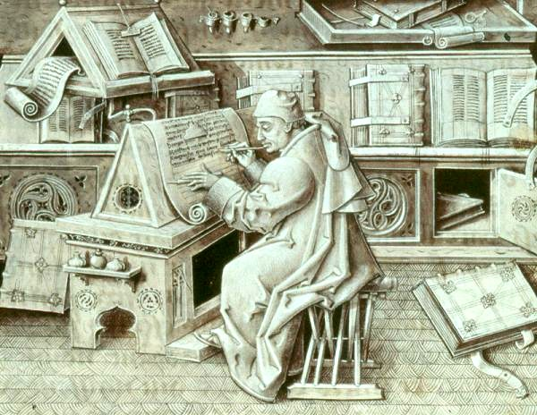

# Scriptorium 

(/skrɪpˈtɔːriəm/), is commonly used to refer to a room in medieval European monestaries devoted to the writing, copying and illuminating of manuscripts commonly handled by the monastic scribes

This project provides an immutable environment for managing digital documents.

    templates = {
    documents = {
        doc = documents.build {
          config = {
            name = "Kento_Okura_Bsc_Thesis_2022";
            title = ''The Geometry and Logic of the \\'Etale Site'';
            author = "Kento Okura";
            root_dir = ./thesis;
            root_file = "main.tex";
            advisor = "Ivan Di Liberti (Stockholm University)";
            degree_code = "A 033621";
            date = "Wien, im Monat September 2022";
            field = "Mathematik";
          };
    };
  };
}

At the moment, running nix flake show shows a linux package 'texBuilder'.
The plan is to provide a bunch of different builders, such as texBuilder or
moodleBuilder for building documents

# thesis

The thesis/flake.nix file defines a configurable package which builds a latex
document. I am trying to get the title page template to work
